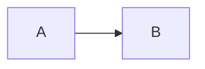
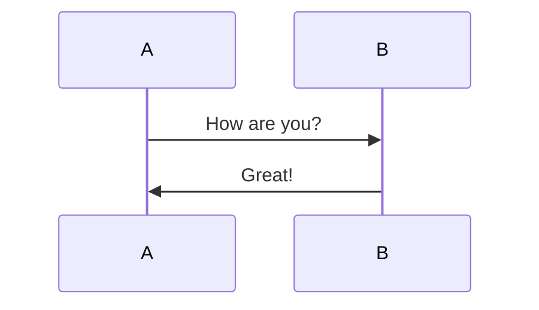
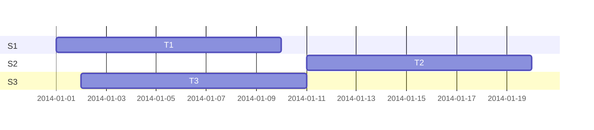

# Markdown语法指南

[TOC]

### 二级

#### 三级

##### 四级

###### 五级

正文

## 代码表演示

```shell
#!/bin/bash
#be for Linux heath check by shell
uname -a; uptime; id
```

```python
#hello world by python
print ("hello world")
```

> #单行代码
> 
> > uname -a

## 行内标记

代码：标记之外`hello world`标记之外

## 有序列表

1. 111
2. 222
   1. 8888
   2. 9999
3. 333
   * 1111
   * 2222
     
     ## 无序列表
- 11111

- 22222
  
  * 4545555
  * 3333333

- 33333
  
  ## 序表嵌套代码块
  
  注：换行+两个Tab
* test:
  
      var a = 10;
  
  ## 任务列表
- [ ] 选项一

- [x] 选项二 
  
  ## 定义型列表
  
    注：解释型定义
    代码：
  Markdown   
  : 轻量级文本标记语言，可以转换成html，pdf等格式  //  开头一个`:` + `Tab` 或 四个空格
  
  ## 字体
  
  **加粗**
  *倾斜*
  ***加粗和倾斜***
  
  ## 插入链接
  
  [百度 1](http://www.baidu.com/ '百度一下')
  
  ## 插入图片
  
  

## 插入图片带链接

[](http://baidu.com)

## 插入视频

```content
注：Markdown 语法是不支持直接插入视频的
普遍的做法是 插入 HTML 的 iframe 框架，通过网站自带的分享功能获取，如果没有可以尝试第二种方法
第二是伪造播放界面，实质是插入视频图片，然后通过点击跳转到相关页面
代码：
    <iframe height=498 width=510 src='http://player.youku.com/embed/XMjgzNzM0NTYxNg==' frameborder=0 'allowfullscreen'></iframe>
```

<iframe height=498 width=510 src='http://player.youku.com/embed/XMjgzNzM0NTYxNg==' frameborder=0 'allowfullscreen'></iframe>

## 表格

注： : 代表对齐方式 
代码1：
| a  |  b | c  |
|:--:|:-- | --:|
|  居中 |  左对齐 |  右对齐 |
代码2(简约写法)：
a  |  b  | c  
:---:|:------------ |--:
居中 |  左对齐 |  右对齐 
代码3(特殊表格)：使用HTML代码

## 流程图







## 时序图

代码：

```sequence
A->>B: 你好
Note left of A: 我在左边 
Note right of B: 我在右边
B-->A: 很高兴认识你
```

```sequence
起床->吃饭: 稀饭油条
吃饭->上班: 不要迟到了
上班->午餐: 吃撑了
上班->下班:
Note right of 下班: 下班了
下班->回家:
Note right of 回家: 到家了
回家-->>起床:
Note left of 起床: 新的一天
```

## 内联CSS样式

代码：<p style="color: #AD5D0F;font-size: 30px; font-family: '宋体';">内联样式</p>

## 语义标记

代码：
  *斜体*、_斜体_  
  **加粗**  
  ***加粗+斜体***、**_加粗+斜体_**  
  ~~删除线~~    
  ==背景色==  
  $\underline{下划线}$   
  Superscript - superscript
  ^superscript^
  Subscript - subscript
  ~subscript~

## 语义标签

  <i>斜体</i>  
  <b>加粗</b>  
  <em>强调</em>  
  <u>下划线</u>   
  <del>删除</del>  
  Z<sup>a</sup>  
  Z<sub>a</sub>  
  <kbd>Ctrl</kbd>

## 公式

    代码：

$$ x \href{why-equal.html}{=} y^2 + 1 $$
$$ x = {-b \pm \sqrt{b^2-4ac} \over 2a}. $$

## 分隔符

---

或者  

***

## 脚注

   代码：
  Markdown[^1]
  [^1]: Markdown是一种纯文本标记语言        // 在文章最后面显示脚注

## 锚点

    代码：

  [公式标题锚点](#1)

#### [任务列表(类似于多选框)]   {#1}   // 方括号后保持空格
